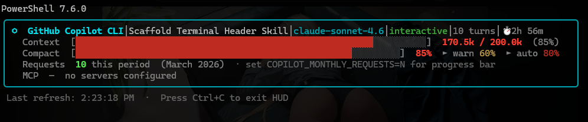

# Quasar HUD 🛸

<p align="center">
  
</p>

A persistent terminal HUD that sits at the top of your Windows Terminal (or tmux) pane and shows live session stats for whichever AI coding CLI you're running — **GitHub Copilot CLI**, **Claude Code**, or **Codex CLI**.

```

╭────────────────────────────────────────────────────────────────────────────╮
│  ⬡  GitHub Copilot CLI  │  fix-auth-bug  │  claude-sonnet-4.6  │  plan    │
│  Context  [██████████████████░░░░░░░░░░░░]  85.4k / 200k  (42%)           │
│  Compact  [████████████████░░░░░░░░░░░░░░]  42%  ► warn 60%  ► auto 80%   │
│  Requests [██████░░░░░░░░░░░░░░░░░░░░░░░░]  142 / 300  (47%)  March 2026  │
│  MCP  ● context-mode  ● github  │  ⚡ context-mode (active)  │  ⏱ 1h 23m │
╰────────────────────────────────────────────────────────────────────────────╯
 Last refresh: 4:12:01 PM  ·  Press Ctrl+C to exit HUD
```

```
╭────────────────────────────────────────────────────────────────────────────╮
│  ◆  Claude Code  │  my-project  │  claude-sonnet-4-6  │  360 turns         │
│  Context  [████████████████████████████░░]  3.8M / 200k  (100%) ← session │
│  Compact  [████████████████████████████░░]  100%  ► warn 60%  ► auto 80%  │
│  Weekly   0 tokens  ·  0 sessions  ·  7d window                            │
│  MCP  ● context-mode                                                        │
╰────────────────────────────────────────────────────────────────────────────╯
```

## What it shows

| Row | Content |
|-----|---------|
| **Header** | CLI symbol + name · session name · model · mode · git branch · turn count · elapsed time |
| **Context** | Token usage bar — used / limit with % and colour-coded warnings (session scope) |
| **Compact** | Compaction progress — visual guide to warn (60%) and auto-compact (80%) thresholds |
| **Requests** | *(Copilot only)* Monthly premium request counter. Set `COPILOT_MONTHLY_REQUESTS=300` for a progress bar |
| **Weekly** | *(Claude only)* 7-day cross-session token burn. Set `CLAUDE_WEEKLY_TOKENS=N` for a progress bar |
| **MCP** | Connected MCP servers · `context-mode` badge with token savings if reported |
| **Footer** | Last refresh time; non-fatal notices |

## Supported CLIs

| CLI | Session data | Token data | context-mode MCP |
|-----|-------------|-----------|-----------------|
| GitHub Copilot | `~/.copilot/session-state/*/workspace.yaml` + `events.jsonl` | ✅ from `outputTokens` events | ✅ via `~/.copilot/mcp.json` |
| Claude Code | `~/.claude/projects/*/` JSONL | ✅ from `usage` fields | ✅ via `~/.claude/config.json` |
| Codex CLI | `~/.codex/session_index.jsonl` + `config.toml` | ⚠ WAL-size estimate | ✅ via `config.toml` |

## Requirements

- Node.js ≥ 18
- Windows Terminal (`wt`) **or** tmux (Linux/macOS)
- The target AI CLI installed and on `PATH`

## Install

**Windows** — paste into any PowerShell terminal:

```powershell
iex (irm https://raw.githubusercontent.com/Sheepdog2142/quasar-hud/main/install.ps1)
```

**macOS / Linux:**

```bash
curl -fsSL https://raw.githubusercontent.com/Sheepdog2142/quasar-hud/main/install.sh | bash
```

The installer checks your Node.js version, installs Quasar HUD globally, and prints the next steps.

### First-time setup

After install, wire the HUD into your shell so it launches automatically:

```powershell
qhud-setup enable --cli=copilot   # GitHub Copilot
qhud-setup enable --cli=claude    # Claude Code
qhud-setup enable --cli=codex     # Codex CLI
qhud-setup enable --cli=all       # all three at once
```

Then reload your shell profile and just type `copilot`, `claude`, or `codex` — the HUD opens in a split pane automatically.

### Run manually

```powershell
qhud --cli=copilot
```

## CLI arguments

| Argument | Default | Description |
|----------|---------|-------------|
| `--cli=<name>` | required | `copilot`, `claude`, or `codex` |
| `--refresh=N` | `2` | Polling interval in seconds |
| `--warn-at=0.N` | `0.6` | Compaction warning threshold (fraction) |
| `--compact-at=0.N` | `0.8` | Auto-compaction threshold (fraction) |
| `--no-elapsed` | — | Hide elapsed session time |
| `--no-branch` | — | Hide git branch |
| `--no-requests` | — | Hide Copilot monthly request row |
| `--no-weekly` | — | Hide Claude weekly usage row |

### Environment variables

| Variable | Description |
|----------|-------------|
| `QHUD_CLI` | Default CLI (`copilot`/`claude`/`codex`) — avoids needing `--cli=` arg |
| `COPILOT_MONTHLY_REQUESTS` | Your monthly Copilot premium request cap (e.g. `300`) — enables the requests progress bar |
| `CLAUDE_WEEKLY_TOKENS` | Your 7-day Claude token budget (e.g. `5000000`) — enables the weekly progress bar |

## Auto-launch setup

Make the HUD open automatically every time you start a CLI:

```powershell
# Enable for one CLI
qhud-setup enable --cli=copilot

# Enable for all three
qhud-setup enable --cli=all

# Check status
qhud-setup status

# Disable
qhud-setup disable --cli=claude
```

This injects a shell wrapper into your `$PROFILE` (PowerShell) or `~/.bashrc`/`~/.zshrc`:

```powershell
# === QUASAR_HUD:copilot ===
function global:copilot {
    & "B:\...\scripts\launch-copilot.ps1" @args
}
# === /QUASAR_HUD:copilot ===
```

After enabling, reload your shell (`$PROFILE`) and typing `copilot` will launch both the HUD and the CLI in a split pane automatically.

## Architecture

```
src/
├── types.ts          — shared type definitions
├── config.ts         — constants, model token limits
├── utils.ts          — YAML/JSON/JSONL/TOML readers, git helpers
├── readers/
│   ├── copilot.ts    — reads ~/.copilot/session-state/ events.jsonl + workspace.yaml
│   ├── claude.ts     — reads ~/.claude/projects/ JSONL session files
│   └── codex.ts      — reads ~/.codex/session_index.jsonl + config.toml
└── ui/
    ├── logos/index.ts      — CLI identity (symbol, label, color)
    ├── App.tsx             — root component + polling loop
    ├── StatusBar.tsx       — layout container
    └── components/
        ├── SessionRow.tsx  — header row
        ├── TokenBar.tsx    — context window progress bar
        ├── CompactionBar.tsx — compaction threshold bar
        └── MCPRow.tsx      — MCP server list + context-mode badge
```

## Adding context-mode token savings

`context-mode` MCP is detected automatically when present in your CLI's config.
To report exact token savings, have the `context-mode` server write a JSON file
to `~/.context-mode/session-stats.json` with the shape:

```json
{ "tokensSaved": 4200, "compressionCount": 3 }
```

The HUD polls this file and displays the savings in the MCP row.

## Build

```powershell
npm run build   # compiles to dist/
```

## License

© 2025 [Quasar Digital](https://quasardigital.co) · Made by [Sheepdog2142](https://github.com/Sheepdog2142)

Free to download and use. Modification and resale are not permitted. See [LICENSE](LICENSE) for full terms.
